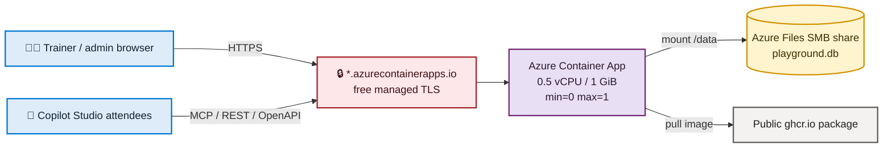
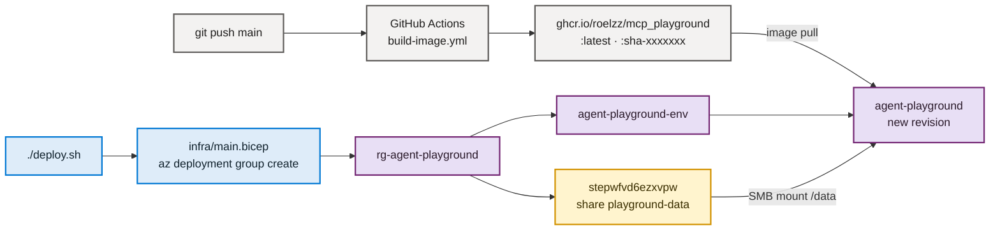
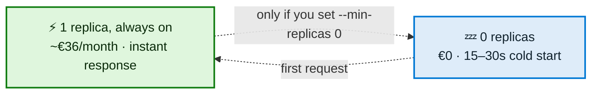

# Azure deployment runbook

## 0. Current deployment

| | |
|---|---|
| URL | `https://agent-playground.wittywave-8fdcd49f.westeurope.azurecontainerapps.io` |
| Subscription | `cape-workshops-fy27` — `4a13d6aa-616a-4f12-a396-e8f4cb8761e0` |
| Resource group | `rg-agent-playground` (westeurope) |
| Container App | `agent-playground` |
| Managed environment | `agent-playground-env` |
| Storage account | `stepwfvd6ezxvpw`, file share `playground-data` |
| Image | `ghcr.io/roelzz/mcp_playground` |
| Admin user | `admin` — password is stored as the ACA secret `bootstrap-password`, never in this repo |

> [!IMPORTANT]
> Deploy **only** into `4a13d6aa-616a-4f12-a396-e8f4cb8761e0`. Set it explicitly before every
> deploy — the CLI default subscription is not reliable, and a shared subscription with other
> people's resource groups sits next to this one.
>
> ```bash
> az account set --subscription 4a13d6aa-616a-4f12-a396-e8f4cb8761e0
> az account show --query "{name:name, id:id}" -o table
> ```

Read the admin password back out of the running app when you need it:

```bash
az containerapp secret show -n agent-playground -g rg-agent-playground \
  --secret-name bootstrap-password --query value -o tsv
```

## 1. What gets deployed

This deploys one Azure Container App in Consumption mode:

- Azure Container Apps Consumption, pinned to one always-on replica.
- `maxReplicas: 1`.
- One SQLite database on an Azure Files SMB share mounted at `/data`.
- Container image pulled from a public `ghcr.io` package.
- Default `*.azurecontainerapps.io` FQDN with free managed TLS.
- No Log Analytics workspace by default.



**`maxReplicas: 1` is a correctness constraint, not a performance setting.** SQLite tolerates exactly one writer. Horizontal scaling creates multiple writers against the same SMB-mounted database and breaks the contract.

## 2. Cost

| Post | Config | Per month |
|---|---|---|
| Container Apps compute | Consumption, 0.5 vCPU / 1 GiB, **min=1** | ~€36 — see below |
| HTTP requests | 2,000,000 free/month | €0 |
| Azure Files | Standard LRS, ~100 MB | < €0.50 |
| Log Analytics | disabled | €0 |
| Container registry | ghcr.io public | €0 |
| Ingress / public IP / TLS | included | €0 |
| **Total** | | **~€36/month** |

The free Consumption grant is **180,000 vCPU-seconds and 360,000 GiB-seconds per subscription
per month**. At 0.5 vCPU / 1 GiB that is roughly 100 running hours — enough for a scale-to-zero
app, nowhere near enough for one that runs 24/7 (~720 h). The grant is **per subscription, not
per app**: other Container Apps in the same subscription can consume it first.

The app is deliberately pinned to `min-replicas 1`, so it costs about €36/month instead of
under €1. That buys away the 15–30s cold start, which otherwise hits the first attendee of
every session and can trip Copilot Studio's connector timeout. See §7 for the reasoning and
for how to switch back to the cheap mode.

## 3. Prerequisites

- Azure subscription.
- `az login`.
- `az account set --subscription <id>`.
- Azure CLI with the Bicep extension.
- A GitHub repository.

This repo is `https://github.com/Roelzz/mcp_playground`, default branch `main`. The image
workflow runs on every push to `main`.

The repo is **public**, so the GHCR package inherits public visibility and Azure Container
Apps can pull without registry credentials. No manual visibility change is needed.

If you later make the repo private, the package becomes private too and you must flip the
package back to Public in GitHub package settings, otherwise the pull fails.

Verify anonymous pullability at any time:

```bash
TOKEN=$(curl -s "https://ghcr.io/token?scope=repository:roelzz/mcp_playground:pull&service=ghcr.io" \
  | python3 -c "import sys,json; print(json.load(sys.stdin)['token'])")
curl -s -o /dev/null -w "%{http_code}\n" -H "Authorization: Bearer $TOKEN" \
  -H "Accept: application/vnd.oci.image.index.v1+json" \
  https://ghcr.io/v2/roelzz/mcp_playground/manifests/latest
```

`200` means public. `401` or `403` means the package is private.

## 4. Deploy

1. Push to `main`. `.github/workflows/build-image.yml` builds and pushes the image.
2. Confirm the image is public with the curl check above.
3. `infra/main.parameters.json` is already filled in:
   - `containerImage`: `ghcr.io/roelzz/mcp_playground:latest`
   - `appName`: default `agent-playground`
   - `location`: default `westeurope`
   - `bootstrapUser`: default `admin`
4. Deploy:

   ```bash
   export BOOTSTRAP_PASSWORD='replace-with-a-long-random-password'
   ./deploy.sh
   ```

5. `deploy.sh` prints the FQDN, the admin UI URL, and the login.

`bootstrapPassword` is deliberately **not** in the parameters file. It is passed at deploy time and stored as an Azure Container Apps secret.



The two halves are independent: Actions only produces an image, `deploy.sh` only reconciles infrastructure. Re-running `deploy.sh` without a new image is safe and idempotent.

## 5. Environment variables in Azure

| Variable | Azure value | Why |
|---|---|---|
| `HOST` | `0.0.0.0` | Bind inside the container. |
| `PORT` | `2009` | Fixed app port. |
| `DB_PATH` | `/data/playground.db` | SQLite file on Azure Files. |
| `SQLITE_JOURNAL_MODE` | `DELETE` | Required on Azure Files/SMB. |
| `SQLITE_VFS` | `unix-dotfile` | Required on Azure Files/SMB. See below. |
| `SQLITE_BUSY_TIMEOUT` | `15000` | Gives SQLite more time on network storage. |
| `PUBLIC_BASE_URL` | `https://<fqdn>` | Public URL used in exports and handouts. |
| `INSECURE_COOKIES` | `0` | HTTPS is used. |
| `LOG_LEVEL` | `INFO` | Default production logging. |
| `BOOTSTRAP_USER` | `admin` | Initial admin username. |
| `BOOTSTRAP_PASSWORD` | ACA secret | Initial admin password. |
| `SESSION_TTL_HOURS` | `12` | How long a browser login stays valid. |
| `RATE_LIMIT_PER_MINUTE` | `300` | Per-caller throttle for API-key and cookie callers. `0` disables. |
| `RATE_LIMIT_PER_MINUTE_ANON` | `6000` | Throttle for callers identified only by IP. See the warning in §7. |
| `ALLOW_PRIVATE_UPSTREAM` | unset | **Never set this in Azure.** It disables the SSRF guard on private addresses. |
| `UPSTREAM_ALLOWLIST` | unset | Optional comma-separated hosts allowed as proxy upstreams. |
| `AUTH_DISABLED` | unset | **Never set this in Azure.** Local development only. |

### `SQLITE_JOURNAL_MODE=DELETE`

WAL requires a `-shm` file backed by real `mmap` shared memory. SMB does not support it. WAL on Azure Files produces `database is locked` errors or silent corruption. SQLite's own docs warn against WAL on network filesystems.

### `SQLITE_VFS=unix-dotfile`

Turning WAL off is **not enough**. SQLite's default VFS also uses POSIX byte-range locks for regular journaling, and CIFS/SMB handles those unreliably. The container still crash-looped on `database is locked` inside `init_db()` with `SQLITE_JOURNAL_MODE=DELETE` alone.

The `unix-dotfile` VFS replaces byte-range locks with a lock *file*, which is exactly what network filesystems support. It ships with the stdlib `sqlite3` module — no extra dependency — and is selected through a URI:

```python
sqlite3.connect(f"file:{path}?vfs=unix-dotfile", uri=True)
```

**Do not use `PRAGMA locking_mode = EXCLUSIVE` instead.** It was tried and rejected: the app opens multiple concurrent connections (per-request in `auth.get_conn`, plus long-lived ones in `main.py`), so the first connection holds the exclusive lock forever and every later `connect()` fails. `maxReplicas=1` does not help — the contention is inside one process. Ten tests in `tests/test_main_wiring.py` fail immediately under that setting.

Note that WAL is impossible under this VFS (no shared memory), so SQLite silently falls back to another journal mode. Set `SQLITE_JOURNAL_MODE=DELETE` explicitly so the behaviour is intentional rather than accidental.

### `PUBLIC_BASE_URL`

`PUBLIC_BASE_URL` is baked into every exported Swagger/OpenAPI document by `portability.py`'s `build_swagger`. If it is wrong, every attendee's Power Platform custom connector points at `localhost:2009` and fails silently.

Bicep sets it automatically from the environment's `defaultDomain`. Verify it after deploy.

## 6. The FQDN is stable — except once

`<app>.<env-id>.<region>.azurecontainerapps.io` survives revisions, restarts, scale-to-zero, and redeploys.

It changes **only** if the app or the managed environment is deleted and recreated.

> [!WARNING]
> `teardown.sh` is irreversible in a way that matters. It deletes the managed environment. A rebuild gets a different URL, and every URL already handed to 200 attendees breaks.

## 7. Bootcamp day runbook

> [!WARNING]
> Attendees reach the seeded servers through Copilot Studio, which calls out from a small
> pool of shared Microsoft egress addresses. Because those servers run `auth_mode: none`,
> every attendee lands in the **same** IP rate-limit bucket. That is why
> `RATE_LIMIT_PER_MINUTE_ANON` defaults to `6000` rather than `300`. If a cohort ever sees
> `429 rate limit exceeded`, raise it or set it to `0` for the day:
>
> ```bash
> az containerapp update -n agent-playground -g rg-agent-playground \
>   --set-env-vars RATE_LIMIT_PER_MINUTE_ANON=0
> ```

The app is pinned warm. The live scale config is:

```json
{"minReplicas": 1, "maxReplicas": 1, "cooldownPeriod": 300, "pollingInterval": 30}
```

`minReplicas: 1` is a deliberate choice, not a leftover. Scale-to-zero costs nothing but
makes the first request after an idle period take 15–30s, and two things go wrong with that:

- The first attendee of the day eats the cold start.
- Copilot Studio's connector timeout can be shorter than the cold start, so the connector
  test fails while nothing is actually broken.

Running one replica around the clock is roughly 720 vCPU-hours a month — about **€36** —
which is accepted as the price of never debugging a cold start during a session.

Read the live config back yourself:

```bash
az containerapp show -n agent-playground -g rg-agent-playground \
  --query "properties.template.scale" -o json
```



If you ever want the cheap mode back — between bootcamp seasons, say:

```bash
az containerapp update -n agent-playground -g rg-agent-playground --min-replicas 0
```

> [!NOTE]
> With `minReplicas: 1` there is nothing to do on the morning of a bootcamp. The app is
> already warm. `cooldownPeriod` and `pollingInterval` no longer have any effect, since
> the replica never scales in.

## 8. Migrating existing local data (optional)

The local DB runs in WAL mode with an uncheckpointed `-wal` file. **Uploading only `playground.db` loses data.**

Correct order:

```bash
sqlite3 playground.db "PRAGMA wal_checkpoint(TRUNCATE);"
sqlite3 playground.db "PRAGMA journal_mode = DELETE;"
az storage file upload --share-name playground-data --source playground.db --account-name <storage> --path playground.db
```

> [!NOTE]
> Forgetting the `journal_mode = DELETE` step used to break the boot with a bare
> `sqlite3.OperationalError: unable to open database file`. WAL needs mmap-backed shared
> memory that the `unix-dotfile` VFS cannot provide, so the file simply will not open.
> `db.ensure_journal_compatible()` now runs once at startup, converts a WAL database to
> `DELETE` and logs a warning. Committed data survives, because converting checkpoints the
> `-wal` file first. The explicit steps above are still the tidier path.

Simpler alternative: upload nothing. A fresh volume self-seeds through the app lifespan: `init_db` → `seed_if_empty` → `auth.bootstrap`. Then author through the admin UI or the 57 admin MCP tools.
For a fresh bootcamp, that is probably better.

`portability.py` export/import bundles are the actual backup/DR strategy. There are no automated Azure backups.

## 9. Verify after deploy

```bash
curl -fsS https://<fqdn>/health
```

Then:

- Log in at `https://<fqdn>/ui/`.
- Check `/data` is writable. The container runs as non-root user `app`. ACA usually mounts Azure Files with `dir_mode=0777`, but that is not guaranteed. If the app cannot write, it fails on first write:

  ```bash
  az containerapp exec -n <app> -g <rg> --command "touch /data/.probe && ls -la /data"
  ```

- Export one Swagger document and confirm `servers[0].url` is the real HTTPS FQDN, not `localhost:2009`.
- Stream live logs:

  ```bash
  az containerapp logs show -n <app> -g <rg> --follow
  ```

## 10. Troubleshooting

| Symptom | Cause | Fix |
|---|---|---|
| `database is locked` | `SQLITE_JOURNAL_MODE` is still `WAL`, or `SQLITE_VFS` is unset, on Azure Files. | Set `SQLITE_JOURNAL_MODE=DELETE` **and** `SQLITE_VFS=unix-dotfile`, deploy while scaled to zero, then restart. |
| Permission denied on `/data` | Azure Files mount permissions do not allow writes by non-root user `app`. | Run the `/data` probe from §9. Fix mount options or storage permissions. |
| Copilot Studio connector test times out | Cold start, so the app was scaled to zero. | Confirm `minReplicas` is `1` — see §7. |
| Connectors point at `localhost` | `PUBLIC_BASE_URL` is wrong. | Set it to `https://<fqdn>` and re-export Swagger. |
| `ImagePullBackOff` | GHCR package is private. | Make the package public in GitHub package settings, then restart the Container App. Public repos publish public packages automatically. |
| No historical logs | Log Analytics is deliberately disabled. | Live streaming works. Attach a workspace temporarily if historical queries are needed. |
| Bicep fails with `InvalidLogDestination` or a validation error on `appLogsConfiguration` | `destination: 'none'` is **not** a valid value, despite what the CLI flag `--logs-destination none` suggests. | "None" means *omit the property*. `infra/main.bicep` uses `appLogsConfiguration: {}`. Do not put a `destination` key back in. |
| `docker.io` rate limit or unauthorised pull | Image reference lost its `ghcr.io/` prefix and resolved to Docker Hub. | Check `containerImage` in `infra/main.parameters.json` starts with `ghcr.io/`. |

## 11. Known limitations

- Single replica, no HA, no horizontal scaling — by design.
- No automated backups; use export bundles.
- No custom domain.
- No staging environment.
- Revision rollout in single-revision mode briefly starts the new revision before draining
  the old, so there can momentarily be two SQLite writers. With `minReplicas: 1` the app is
  never idle, so **deploy outside use hours** — you can no longer wait for it to scale to zero.
- Historical logging is disabled to avoid cost.
- **Every database read costs roughly a second.** Measured against the live app:

  | Request | Time |
  |---|---|
  | `/health` (no database) | 68 ms |
  | `/api/servers` | ~0.9 s |
  | MCP `tools/list` | ~2.0 s |
  | MCP `tools/call` | ~2.4 s |

  The network is not the problem — the SMB share is. Every request opens a fresh connection,
  takes a dotfile lock, and with `DELETE` journaling creates and removes a journal file per
  transaction, each a round trip to Azure Files. Requests still run in parallel, so a cohort
  gets through, but every Copilot Studio tool call feels about two seconds slow.

  Accepted for bootcamp use. If it ever needs fixing, the levers are connection reuse instead
  of a connection per request, `PRAGMA synchronous = NORMAL`, and a larger page cache — all of
  which touch the transaction and thread-safety logic in `db.py`, so none of them are free.
