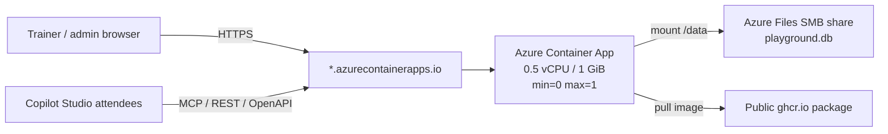

# Azure deployment runbook

## 1. What gets deployed

This deploys one Azure Container App in Consumption mode:

- Azure Container Apps Consumption, scale-to-zero.
- `maxReplicas: 1`.
- One SQLite database on an Azure Files SMB share mounted at `/data`.
- Container image pulled from a public `ghcr.io` package.
- Default `*.azurecontainerapps.io` FQDN with free managed TLS.
- No Log Analytics workspace by default.



**`maxReplicas: 1` is a correctness constraint, not a performance setting.** SQLite tolerates exactly one writer. Horizontal scaling creates multiple writers against the same SMB-mounted database and breaks the contract.

## 2. Cost

| Post | Config | Per month |
|---|---|---|
| Container Apps compute | Consumption, 0.5 vCPU / 1 GiB, min=0 | €0 — within free grant |
| HTTP requests | 2,000,000 free/month | €0 |
| Azure Files | Standard LRS, ~100 MB | < €0.50 |
| Log Analytics | disabled | €0 |
| Container registry | ghcr.io public | €0 |
| Ingress / public IP / TLS | included | €0 |
| **Total** | | **< €1/month** |

The free Consumption grant is **180,000 vCPU-seconds and 360,000 GiB-seconds per subscription per month**. At 0.5 vCPU / 1 GiB, that is roughly 100 running hours. The grant is **per subscription, not per app**: other Container Apps in the same subscription can consume it first.

Running 24/7 without scale-to-zero is roughly 720 h/month, about €36/month. Scale-to-zero is the entire business case.

## 3. Prerequisites

- Azure subscription.
- `az login`.
- `az account set --subscription <id>`.
- Azure CLI with the Bicep extension.
- A GitHub repository.

This repo is `https://github.com/Roelzz/mcp_playground`, default branch `main`. The image
workflow runs on every push to `main`.

The repo is **public**, so the GHCR package inherits public visibility and Azure Container
Apps can pull without registry credentials. No manual visibility change is needed.

If you later make the repo private, the package becomes private too and you must flip the
package back to Public in GitHub package settings, otherwise the pull fails.

Verify anonymous pullability at any time:

```bash
TOKEN=$(curl -s "https://ghcr.io/token?scope=repository:roelzz/mcp_playground:pull&service=ghcr.io" \
  | python3 -c "import sys,json; print(json.load(sys.stdin)['token'])")
curl -s -o /dev/null -w "%{http_code}\n" -H "Authorization: Bearer $TOKEN" \
  -H "Accept: application/vnd.oci.image.index.v1+json" \
  https://ghcr.io/v2/roelzz/mcp_playground/manifests/latest
```

`200` means public. `401` or `403` means the package is private.

## 4. Deploy

1. Push to `main`. `.github/workflows/build-image.yml` builds and pushes the image.
2. Confirm the image is public with the curl check above.
3. `infra/main.parameters.json` is already filled in:
   - `containerImage`: `ghcr.io/roelzz/mcp_playground:latest`
   - `appName`: default `agent-playground`
   - `location`: default `westeurope`
   - `bootstrapUser`: default `admin`
4. Deploy:

   ```bash
   export BOOTSTRAP_PASSWORD='replace-with-a-long-random-password'
   ./deploy.sh
   ```

5. `deploy.sh` prints the FQDN, the admin UI URL, and the login.

`bootstrapPassword` is deliberately **not** in the parameters file. It is passed at deploy time and stored as an Azure Container Apps secret.

## 5. Environment variables in Azure

| Variable | Azure value | Why |
|---|---|---|
| `HOST` | `0.0.0.0` | Bind inside the container. |
| `PORT` | `2009` | Fixed app port. |
| `DB_PATH` | `/data/playground.db` | SQLite file on Azure Files. |
| `SQLITE_JOURNAL_MODE` | `DELETE` | Required on Azure Files/SMB. |
| `SQLITE_VFS` | `unix-dotfile` | Required on Azure Files/SMB. See below. |
| `SQLITE_BUSY_TIMEOUT` | `15000` | Gives SQLite more time on network storage. |
| `PUBLIC_BASE_URL` | `https://<fqdn>` | Public URL used in exports and handouts. |
| `INSECURE_COOKIES` | `0` | HTTPS is used. |
| `LOG_LEVEL` | `INFO` | Default production logging. |
| `BOOTSTRAP_USER` | `admin` | Initial admin username. |
| `BOOTSTRAP_PASSWORD` | ACA secret | Initial admin password. |

### `SQLITE_JOURNAL_MODE=DELETE`

WAL requires a `-shm` file backed by real `mmap` shared memory. SMB does not support it. WAL on Azure Files produces `database is locked` errors or silent corruption. SQLite's own docs warn against WAL on network filesystems.

### `SQLITE_VFS=unix-dotfile`

Turning WAL off is **not enough**. SQLite's default VFS also uses POSIX byte-range locks for regular journaling, and CIFS/SMB handles those unreliably. The container still crash-looped on `database is locked` inside `init_db()` with `SQLITE_JOURNAL_MODE=DELETE` alone.

The `unix-dotfile` VFS replaces byte-range locks with a lock *file*, which is exactly what network filesystems support. It ships with the stdlib `sqlite3` module — no extra dependency — and is selected through a URI:

```python
sqlite3.connect(f"file:{path}?vfs=unix-dotfile", uri=True)
```

**Do not use `PRAGMA locking_mode = EXCLUSIVE` instead.** It was tried and rejected: the app opens multiple concurrent connections (per-request in `auth.get_conn`, plus long-lived ones in `main.py`), so the first connection holds the exclusive lock forever and every later `connect()` fails. `maxReplicas=1` does not help — the contention is inside one process. Ten tests in `tests/test_main_wiring.py` fail immediately under that setting.

Note that WAL is impossible under this VFS (no shared memory), so SQLite silently falls back to another journal mode. Set `SQLITE_JOURNAL_MODE=DELETE` explicitly so the behaviour is intentional rather than accidental.

### `PUBLIC_BASE_URL`

`PUBLIC_BASE_URL` is baked into every exported Swagger/OpenAPI document by `portability.py`'s `build_swagger`. If it is wrong, every attendee's Power Platform custom connector points at `localhost:2009` and fails silently.

Bicep sets it automatically from the environment's `defaultDomain`. Verify it after deploy.

## 6. The FQDN is stable — except once

`<app>.<env-id>.<region>.azurecontainerapps.io` survives revisions, restarts, scale-to-zero, and redeploys.

It changes **only** if the app or the managed environment is deleted and recreated.

> [!WARNING]
> `teardown.sh` is irreversible in a way that matters. It deletes the managed environment. A rebuild gets a different URL, and every URL already handed to 200 attendees breaks.

## 7. Bootcamp day runbook

Scale-to-zero means the first request after about 5 minutes idle takes 15–30s.

Two concrete risks:

- The first attendee of the day eats the cold start.
- Copilot Studio's connector timeout can be shorter than the cold start. The connector test fails while nothing is actually broken.

```bash
# morning of the bootcamp
az containerapp update -n <app> -g <rg> --min-replicas 1

# after it ends
az containerapp update -n <app> -g <rg> --min-replicas 0
```

Eight hours at `min=1` still fits inside the free grant. Costs nothing, removes the risk on the day it matters.

## 8. Migrating existing local data (optional)

The local DB runs in WAL mode with an uncheckpointed `-wal` file. **Uploading only `playground.db` loses data.**

Correct order:

```bash
sqlite3 playground.db "PRAGMA wal_checkpoint(TRUNCATE);"
sqlite3 playground.db "PRAGMA journal_mode = DELETE;"
az storage file upload --share-name playground-data --source playground.db --account-name <storage> --path playground.db
```

Simpler alternative: upload nothing. A fresh volume self-seeds through the app lifespan: `init_db` → `seed_if_empty` → `auth.bootstrap`. Then author through the admin UI or the 57 admin MCP tools.

For a fresh bootcamp, that is probably better.

`portability.py` export/import bundles are the actual backup/DR strategy. There are no automated Azure backups.

## 9. Verify after deploy

```bash
curl -fsS https://<fqdn>/health
```

Then:

- Log in at `https://<fqdn>/ui/`.
- Check `/data` is writable. The container runs as non-root user `app`. ACA usually mounts Azure Files with `dir_mode=0777`, but that is not guaranteed. If the app cannot write, it fails on first write:

  ```bash
  az containerapp exec -n <app> -g <rg> --command "touch /data/.probe && ls -la /data"
  ```

- Export one Swagger document and confirm `servers[0].url` is the real HTTPS FQDN, not `localhost:2009`.
- Stream live logs:

  ```bash
  az containerapp logs show -n <app> -g <rg> --follow
  ```

## 10. Troubleshooting

| Symptom | Cause | Fix |
|---|---|---|
| `database is locked` | `SQLITE_JOURNAL_MODE` is still `WAL`, or `SQLITE_VFS` is unset, on Azure Files. | Set `SQLITE_JOURNAL_MODE=DELETE` **and** `SQLITE_VFS=unix-dotfile`, deploy while scaled to zero, then restart. |
| Permission denied on `/data` | Azure Files mount permissions do not allow writes by non-root user `app`. | Run the `/data` probe from §9. Fix mount options or storage permissions. |
| Copilot Studio connector test times out | Cold start after scale-to-zero. | Use the bootcamp day runbook in §7. |
| Connectors point at `localhost` | `PUBLIC_BASE_URL` is wrong. | Set it to `https://<fqdn>` and re-export Swagger. |
| `ImagePullBackOff` | GHCR package is private. | Make the package public in GitHub package settings, then restart the Container App. Public repos publish public packages automatically. |
| No historical logs | Log Analytics is deliberately disabled. | Live streaming works. Attach a workspace temporarily if historical queries are needed. |

## 11. Known limitations

- Single replica, no HA, no horizontal scaling — by design.
- No automated backups; use export bundles.
- No custom domain.
- No staging environment.
- Revision rollout in single-revision mode briefly starts the new revision before draining the old, so there can momentarily be two SQLite writers. **Deploy while the app is scaled to zero, outside use hours.**
- Historical logging is disabled to avoid cost.
