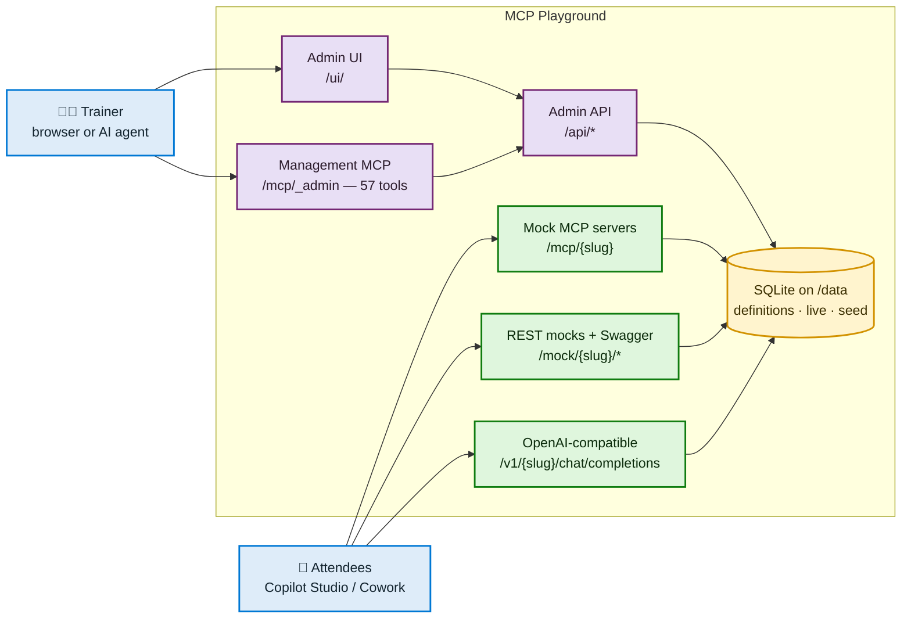
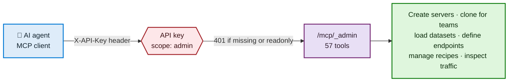
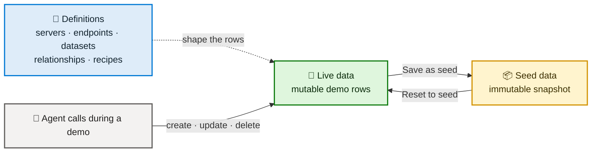
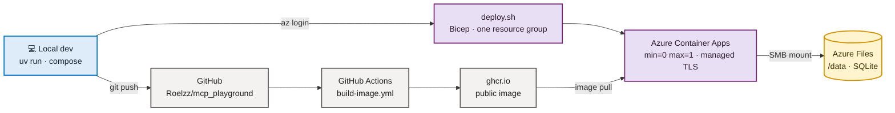

# MCP Playground

## What this is

MCP Playground is a browser-managed playground for authoring persistent mock MCP servers and OpenAI-compatible endpoints. It is purpose-built for Microsoft Copilot Studio demos, bootcamps, and solution-architecture training. Admins can model multiple mock servers, multiple endpoints, and shared demo datasets. Definitions and live demo data persist, so trainees can keep working across restarts.

## Exposed surfaces

| Surface | Path | Auth |
|---|---|---|
| Admin UI | `/ui/` | session cookie |
| Admin CRUD API | `/api/*` | session cookie or API key; writes require `admin` scope |
| Mock MCP server | `/mcp/{slug}` | per-server (open or API key) |
| Management MCP server | `/mcp/_admin` | API key, `admin` scope |
| Plain REST mock | `/mock/{slug}/*` | per-server (open or API key) |
| OpenAI-compatible chat | `POST /v1/{slug}/chat/completions` | per-endpoint (open or API key) |
| Public recipe playbooks | `/r/`, `/r/{slug}`, `/api/public/recipes` | open, read-only |
| Health | `/health` | open |



Purple is trainer-only and needs admin auth. Green is what attendees consume. Everything reads and writes the same SQLite file, so a change made through the UI is instantly visible over MCP, REST, and Swagger.

## Quick start (local, no container)

```bash
uv sync
cp .env.example .env
uv run python main.py
curl http://localhost:2009/health
```

Expected response:

```json
{"status":"ok"}
```

## Quick start (container)

```bash
docker compose up --build
```

Podman equivalent:

```bash
podman compose up --build
```

Then verify:

```bash
curl http://localhost:2009/health
```

## Configuration

Copy `.env.example` to `.env` and edit values for your environment.

| Key | Meaning | Default |
| --- | --- | --- |
| `LOG_LEVEL` | Loguru log level. | `INFO` |
| `HOST` | Host interface the FastAPI server binds to. Use `0.0.0.0` in containers. | `0.0.0.0` |
| `PORT` | Application port. Keep this at `2009`. | `2009` |
| `DB_PATH` | SQLite database file path. Containers override this to `/data/playground.db`. | `playground.db` |
| `PUBLIC_BASE_URL` | Public base URL used when generating links or callback URLs. | `http://localhost:2009` |
| `BOOTSTRAP_USER` | Optional initial admin username. Leave blank to auto-generate credentials on first boot. | blank |
| `BOOTSTRAP_PASSWORD` | Optional initial admin password. Leave blank to auto-generate credentials on first boot. | blank |
| `INSECURE_COOKIES` | Set to `1` when serving over plain HTTP on a LAN so session cookies still work. | `0` |

## Admin UI

The admin UI at `/ui/` has eleven tabs.

| Tab | What it does |
|---|---|
| Catalog | Browse every server as cards with slug, auth mode, dataset/tool/row counts, and recipe count; clone one server or bulk-clone team copies. |
| Recipes | Manage agent playbooks with instructions, example prompts, toolsets, destinations, and public handouts. |
| Cohort | Bootcamp control panel for team readiness, handout export, traffic by team, and reset-to-seed. |
| Servers | Create and edit mock MCP servers; copy the live MCP URL for each. |
| Datasets | Paste or edit JSON or CSV; inspect the inferred field schema; manage seed snapshots. |
| Endpoints | Define MCP tools by describing REST-like endpoint shapes; tool type is inferred live. |
| LLM endpoints | Create OpenAI-compatible mock or proxy chat endpoints; set first-match-wins response rules. |
| Test console | Call an endpoint over **REST** (`/mock/{slug}/…`) to exercise writes and see the real HTTP status plus a copyable `curl` line, or through the **Executor** path (`/api/servers/{slug}/tools/{tool_name}/call`) which is admin-gated and read-only. |
| Traffic | Browse every recorded request and response; optionally auto-refresh every three seconds. |
| Connect it | Copy the exact values for the Copilot Studio MCP server dialog; also shows custom connector steps with a Swagger export link. |
| API keys | Create global API keys with `readonly` or `admin` scope; the plaintext key is shown once on creation. |

### Catalog and bootcamp cloning

The **Catalog** tab is the first tab in the sidebar. It shows every server in a card grid with slug, auth mode, metrics for datasets, tools, and rows, and an `N recipes` badge. From a card, an admin can create one clone or bulk-clone one source server into numbered team servers.

This is the bootcamp provisioning path: build one good server, then bulk-clone it once per training team.

| Endpoint | Body | Result |
|---|---|---|
| `GET /api/catalog` | none | `200` bare JSON list of servers with counts. |
| `POST /api/servers/{server_id}/clone` | `{"slug": "...", "name": "..."}` where `name` is optional | `201` with the new server; `404` if the source is missing, `409` if the slug exists, `400` if the slug is invalid. |
| `POST /api/servers/{server_id}/bulk-clone` | `{"prefix": "...", "count": N, "start": 1}` where `start` defaults to `1` | `201` with `{"created": [...]}`; `409` if any generated slug exists; `400` if `count` is below `1`, above `50`, or a generated slug is invalid. |

Bulk clone is all-or-nothing. If any target slug already exists, it creates nothing. Slugs are numbered with zero padding to the width of `start + count - 1`, with a minimum width of two: prefix `hr-team`, count `20`, start `1` creates `hr-team01` through `hr-team20`.

Clone deep-copies the server row, datasets, live dataset rows, seed dataset rows, and endpoints with remapped dataset IDs. It does not copy API keys, call log traffic, or LLM endpoints.

Bulk clone deliberately does not clone recipes. A recipe is one assignment that can be used by every team; cloning it once per generated server would create duplicate playbooks that trainers then have to maintain by hand. The public recipe page shows the tools from the template server, and trainers give attendees their team-specific server URL separately.

### Recipes

A recipe is an agent playbook: a scenario-level assignment that tells a bootcamp attendee what agent to build. It contains a title, skill badge, department, summary, example prompts, copy-paste `agent_instructions`, a set of MCP tools, and optional informational destinations such as Outlook or Teams.

Schema version was bumped from **2** to **3** and adds two tables:

| Table | Purpose |
|---|---|
| `recipe` | Instance-level playbook metadata: slug, title, skill, department, summary, instructions, prompts, destinations, and published state. |
| `recipe_tool` | Join table from a recipe to selected endpoint tools, including the source server for each tool. |

Recipes are the deliberate exception to the rest of the schema. Everywhere else `server_id` is a foreign key. A recipe can span tools from multiple servers, so it is an instance-level object, not a child of one server.

The **Recipes** tab sits between Catalog and Cohort. It has a recipe list on the left and an editor on the right for slug, title, department, skill, summary, agent instructions, published state, example prompts, server+tool picker, and destination tags. Actions are **Save**, **Delete**, **Copy public link**, **Open public page**, and **Download handout**.

Admin API under `/api` is session-gated:

| Endpoint | Result |
|---|---|
| `GET /api/recipes` | List recipes. |
| `POST /api/recipes` | Create a recipe. |
| `GET /api/recipes/{recipe_id}` | Read one recipe. |
| `PATCH /api/recipes/{recipe_id}` | Update one recipe. |
| `DELETE /api/recipes/{recipe_id}` | Delete one recipe. |
| `PUT /api/recipes/{recipe_id}/tools` | Replace the whole toolset in one call. |
| `GET /api/recipes/validate` | Validation report; never raises. |
| `GET /api/recipes/departments` | Distinct departments with recipe counts. |
| `GET /api/recipes/{recipe_id}/handout` | Markdown handout; add `?download=true` to download. |

Public surface:

| Endpoint | Result |
|---|---|
| `GET /r/` | Public **Agent Playbook** index with cards filtered by skill and department. |
| `GET /r/{slug}` | Public recipe detail page. |
| `GET /api/public/recipes` | JSON used by the public pages. |

This is the first unauthenticated HTML surface in the app. It is read-only: no session, no cookie, no POST, and no mutation. Only `published = 1` recipes are exposed. A draft or unknown slug returns **404**, not 403, so existence is not leaked. The public API never exposes API keys, password hashes, or `call_log`.

First boot seeds 7 published recipes:

| Slug | Title | Skill | Department |
|---|---|---|---|
| `order-status-assistant` | Order status assistant | beginner | Sales Operations |
| `leave-request-handling` | Leave request handling | beginner | Human Resources |
| `it-ticket-triage` | IT ticket triage | intermediate | IT Operations |
| `pipeline-review` | Pipeline review | intermediate | Sales Operations |
| `expense-approval` | Expense approval | intermediate | Finance & Procurement |
| `expense-manager-lookup` | Expense + manager lookup | advanced | Finance & Procurement (cross-server) |
| `order-problem-it-ticket` | Order problem → IT ticket | advanced | Operations & Supply Chain (cross-server) |

The seed set spans 5 servers, 15 datasets, 42 endpoints, and 40 recipe-to-tool links.

The management MCP server exposes nine recipe tools: `list_recipes`, `get_recipe`, `create_recipe`, `update_recipe`, `delete_recipe`, `set_recipe_tools`, `validate_recipes`, `list_recipe_departments`, and `get_recipe_handout`.

### Theme

The UI uses a green brand palette: `--brand: #16a34a` in light mode and `#22c55e` in dark mode. The success colour `--ok` is teal (`#0e7490`) so success callouts stay distinct from the brand colour.

The header has a sun/moon toggle. The selected theme is stored in `localStorage.theme` and applied to `<html data-theme="...">`. If no explicit choice exists, the default follows `prefers-color-scheme`.

An inline script in `<head>` applies the theme before first paint, preventing a white flash on reload. `@media print` forces light tokens so recipe handouts print legibly.

### Cohort control panel

The **Cohort** tab is the third tab in the sidebar. It is the bootcamp control panel for trainers.

| Panel | What it does |
|---|---|
| Team servers | One row per server with slug, name, readiness status, auth mode, dataset/endpoint/row summary, call count, last call, MCP URL, and REST URL. Each URL has a Copy button. A text filter narrows the list. `Ready` means seeded, in sync, and no auth. `Data drift` means live rows differ from seed rows. Seeded API-key servers show `Needs key`. |
| Handout preview | Print-friendly `Team slug | MCP URL | REST URL | Auth note` table. **Copy as Markdown**, **Download CSV**, and **Print view** all honour the current filter. |
| Traffic by team | Per-server calls, OK count, error count, average duration, and last call, sorted by call count descending. A server absent from this table has not called anything yet. |
| Reset training environment | Destructive reset panel. `Prefix filter` plus **Reset matching servers** behind a confirm dialog. Empty prefix resets all servers. Live rows are restored from seed rows. |

Set `PUBLIC_BASE_URL` before exporting handouts. Cohort URLs are built from `PUBLIC_BASE_URL`, defaulting to `http://localhost:2009`. If you leave the default, the handout contains `localhost` URLs that only work on the trainer's machine.

API keys are global, not per-server. The `api_key` table has no `server_id` column. Keys are sha256-hashed and the plaintext is shown exactly once at creation. The handout cannot contain a per-team API key. Servers with `auth_mode='none'` are handout-ready as-is; servers with `auth_mode='api_key'` need a key distributed out-of-band.

| Endpoint | Result |
|---|---|
| `GET /api/cohort` | `200` bare JSON list. Each item has `id`, `slug`, `name`, `description`, `auth_mode`, `dataset_count`, `endpoint_count`, `row_count`, `seed_count`, `seeded`, `in_sync`, `call_count`, `last_call_at`, `mcp_url`, `rest_url`, and `swagger_url`. |
| `GET /api/traffic/summary` | `200` bare JSON list grouped by `target_slug`, with `call_count`, `ok_count`, `error_count`, `avg_duration_ms`, and `last_call_at`, ordered by call count descending. |
| `POST /api/servers/reset-all-to-seed` | `200` reset summary. Body is optional; bodyless resets all servers. Use `{"prefix": "hr-team"}` to reset only matching slugs. |

### Multi-table datasets and relationships

Datasets stay flat JSON row collections. A relationship is metadata that links a field on one dataset to a field on another, so callers can inline related rows at query time with the `expand` query parameter. Relationships are declared per server on the **Datasets** tab.

Relationships are advisory. They do not enforce foreign keys in SQLite, they do not cascade, and they do not block writes that break a link. A missing parent resolves to `null`; a childless parent resolves to `[]`.

Rules:

- `expand` works on read operations only. `create`, `update`, and `delete` with `expand` return `400`.
- Depth is one level. A dotted name such as `order.customer` returns `400`.
- At most 5 expand names per request. Repeats are deduplicated.
- `summary_fields` projection is preserved; expanded keys are merged on top of it.
- A forward expand returns an object or `null`. An inverse expand returns an array.
- `expand`, `limit`, `offset`, and `_row_id` are reserved and cannot be used as expand names.

| Endpoint | Body | Result |
|---|---|---|
| `GET /api/servers/{server_id}/relationships` | none | `200` list of relationships for the server. |
| `GET /api/servers/{server_id}/relationships/validate` | none | `200` `{"ok": bool, "relationship_count": N, "issues": [...]}`. Never raises; orphan rows surface as issues. |
| `POST /api/servers/{server_id}/relationships` | `{"name", "source_dataset_id", "source_field", "target_dataset_id", "target_field", "relation_type", "expand_name", "inverse_expand_name", "required", "description"}` | `201` with the relationship; `409` on a duplicate expand name; `400` on a cross-server dataset, a reserved name, or a bad relation type. |
| `DELETE /api/relationships/{relationship_id}` | none | `204`; `404` if it does not exist. |
| `POST /api/relationships/ensure-demo` | `{"server_id": N}` optional | `200` `{"servers_touched", "relationships_created", "skipped_existing"}`. Idempotent. |
| `GET /api/datasets/{dataset_id}/expands` | none | `200` list of available expand names with `direction`, `returns`, and the target dataset. |

`relation_type` is `many_to_one` or `one_to_one`. Self-references are allowed. The same six operations are exposed as management MCP tools.

Example: `GET /mock/contoso-orders/order-lines?expand=order` inlines the parent order into every line. `GET /mock/contoso-orders/orders/1001?expand=lines` inlines the line array into the order.

## Seeded sample servers

First boot seeds 5 servers, 15 datasets, 42 endpoints, 12 relationships, 1 mock LLM endpoint, and 7 published recipes. All five seeded servers use `auth_mode='none'`, so they are handout-ready without a key.

| Slug | Name | Datasets | Tools | Rows |
|---|---|---|---|---|
| `contoso-orders` | Contoso Orders | 2 | 7 | 160 |
| `northwind-hris` | Northwind HRIS | 3 | 9 | 64 |
| `fabrikam-it-service` | Fabrikam IT Service Desk | 3 | 8 | 56 |
| `adatum-crm` | Adatum Sales CRM | 3 | 9 | 76 |
| `contoso-expenses` | Contoso Travel Expenses | 4 | 9 | 116 |

Dataset row totals: `contoso-orders` has `orders` 40 / `order_lines` 120; `northwind-hris` has `employees` 30 / `time_off_requests` 28 / `org_units` 6; `fabrikam-it-service` has `tickets` 30 / `assets` 18 / `service_catalog` 8; `adatum-crm` has `accounts` 20 / `contacts` 30 / `opportunities` 26; `contoso-expenses` has `expense_reports` 24 / `expense_lines` 60 / `cost_centres` 8 / `approvals` 24.

Seeded recipes span all 5 servers, all 15 datasets, all 42 endpoints, and 40 recipe-to-tool links. Two recipes are cross-server.

## Calling a server over plain REST

Every server is exposed twice from the same endpoint definitions.

| Surface | URL | Use it for |
| --- | --- | --- |
| MCP | `/mcp/{slug}` | Copilot Studio MCP onboarding wizard |
| REST | `/mock/{slug}` | Custom connectors, Postman, curl, any HTTP client |

The REST surface uses the endpoint's own method and path verbatim.

```bash
curl http://localhost:2009/mock/contoso-orders/orders?limit=5
curl http://localhost:2009/mock/contoso-orders/orders/1001
curl "http://localhost:2009/mock/contoso-orders/orders?status=open"
curl "http://localhost:2009/mock/contoso-orders/orders/search?q=northwind"
curl -X POST http://localhost:2009/mock/contoso-orders/orders \
  -H 'content-type: application/json' \
  -d '{"customer":"Fabrikam","status":"open","total":42}'
curl -X DELETE http://localhost:2009/mock/contoso-orders/orders/1001
```

Query string, JSON body and path placeholders are merged into one flat parameter set. Create returns `201`, everything else returns `200`.

The **Test console** in the admin UI calls this surface directly. Pick `REST — /mock/{slug}` as the surface to exercise writes and see the real HTTP status plus a copyable `curl` line. The `Executor` surface is admin-gated and read-only, so it cannot test create, update or delete.

When a server's authentication is set to API key, send the key as `X-API-Key: <key>` or `Authorization: Bearer <key>`.

### Importing into Power Platform as a custom connector

The Swagger export at `/api/servers/{id}/swagger` describes this REST surface, so it imports directly as a custom connector.

1. Download the Swagger from the server's **Connect it** tab.
2. Open Power Apps or Power Automate, go to **Custom connectors**.
3. Choose **New custom connector > Import an OpenAPI file**.
4. Add the connector to your agent in Copilot Studio.

See **[COPILOT-STUDIO.md](COPILOT-STUDIO.md)** for the full runbook covering both connection paths — MCP server onboarding and Swagger-based custom connector.

## Management MCP server

`/mcp/_admin` is a second FastMCP server that exposes **57 tools** mirroring the admin REST API. It lets an LLM agent drive the entire playground — create servers, clone team servers, load datasets, define endpoints, adjust LLM responses, manage recipes, and inspect traffic — without a human touching the web UI.

Authentication: API key with `admin` scope, passed as `X-API-Key: <key>` or `Authorization: Bearer <key>`.

Everything the browser UI can do is also available as an MCP tool, with exactly three intentional exceptions: `POST /api/auth/login`, `POST /api/auth/logout`, and `GET /api/auth/me`. Those are browser-session-cookie endpoints and are meaningless over MCP, which has its own API key auth. `tests/test_mcp_parity.py` enforces this parity automatically so it cannot silently drift.

### Setup

You need an API key with `admin` scope. Create one in the UI (**API keys** tab) or over the API.

**1. Log in and create a key**

```bash
BASE=http://localhost:2009        # or https://<your-fqdn>

curl -s -c /tmp/pg.jar -X POST "$BASE/api/auth/login" \
  -H 'Content-Type: application/json' \
  -d '{"username":"admin","password":"<your-admin-password>"}'

curl -s -b /tmp/pg.jar -X POST "$BASE/api/keys" \
  -H 'Content-Type: application/json' \
  -d '{"label":"admin-mcp","scope":"admin"}'
```

The response contains the plaintext key **exactly once**. Copy it now — only a hash is stored. `scope` is `admin` (read + write) or `readonly`.

**2. Verify the key works**

```bash
curl -s -o /dev/null -w '%{http_code}\n' -X POST "$BASE/mcp/_admin" \
  -H "X-API-Key: <your-key>" \
  -H 'Content-Type: application/json' \
  -H 'Accept: application/json, text/event-stream' \
  -d '{"jsonrpc":"2.0","id":1,"method":"tools/list"}'
```

`200` means you are in. `401` means the key is missing, wrong, or lacks `admin` scope. `406` means the `Accept` header is missing `text/event-stream`.

**3. Point an MCP client at it**

```json
{
  "mcpServers": {
    "playground-admin": {
      "url": "https://<your-fqdn>/mcp/_admin",
      "headers": { "X-API-Key": "<your-key>" }
    }
  }
}
```



Because every UI action has a tool equivalent, an agent can provision an entire bootcamp end to end: clone one source server into 20 team servers, seed their data, mint per-team API keys, and export the handouts — without opening the browser.

Tools are grouped into nine areas:

| Area | Tools |
|---|---|
| Servers | `list_servers`, `get_server`, `create_server`, `clone_server`, `bulk_clone_server`, `get_catalog`, `update_server`, `delete_server`, `get_connection_info`, `export_swagger`, `export_server`, `import_server` |
| Datasets | `list_datasets`, `get_dataset`, `create_dataset`, `update_dataset`, `delete_dataset` |
| Dataset rows | `list_rows`, `replace_rows`, `add_rows`, `reset_to_seed`, `reset_all_to_seed`, `save_as_seed` |
| Endpoints | `list_endpoints`, `get_endpoint`, `create_endpoint`, `update_endpoint`, `delete_endpoint` |
| Relationships | `list_relationships`, `create_relationship`, `delete_relationship`, `validate_relationships`, `ensure_demo_relationships`, `list_expands` |
| LLM endpoints | `list_llm_endpoints`, `get_llm_endpoint`, `create_llm_endpoint`, `update_llm_endpoint`, `delete_llm_endpoint`, `set_llm_responses` |
| Recipes | `list_recipes`, `get_recipe`, `create_recipe`, `update_recipe`, `delete_recipe`, `set_recipe_tools`, `validate_recipes`, `list_recipe_departments`, `get_recipe_handout` |
| API keys | `list_api_keys`, `create_api_key`, `delete_api_key` |
| Misc | `call_tool`, `get_cohort`, `get_traffic`, `get_traffic_summary`, `clear_traffic` |

`reset_all_to_seed` requires `confirm=true`. Without it, the tool returns `{"ok": false, "error": "set confirm=true to proceed", "would_affect": "..."}` and changes nothing.

`list_api_keys` returns key metadata only and never exposes a secret hash. `create_api_key` returns the plaintext key exactly once; copy it immediately because it cannot be retrieved again. `delete_api_key` is destructive and requires `confirm=true`.

`export_swagger` returns the server's Swagger/OpenAPI spec and accepts an optional `base_url` override. `export_server` returns a portable JSON bundle for one server. `import_server` imports that bundle and can override the imported slug.

`validate_recipes` reports recipe issues, `list_recipe_departments` returns department counts, `get_recipe_handout` renders one recipe as Markdown, and `list_expands` lists the available `$expand` paths for a dataset.

## Data & persistence

MCP Playground has three data tiers.

Definitions are the authored servers, endpoints, datasets, relationships, and recipes. They persist forever until an admin changes them.

Live data is the mutable runtime state used during a demo. It persists across restarts and is mutated by agent calls. If an agent creates an order during a demo, that order is still there tomorrow.

Seed data is an immutable snapshot. Reset to seed restores live data back to the snapshot. Save as seed promotes the current live data into the snapshot.



All three tiers live in the same SQLite file and survive restarts. If an agent creates an order during a demo, that order is still there tomorrow — until someone resets to seed.

The Compose setup uses the named Docker volume `playground-data` mounted at `/data`. That is what keeps SQLite data alive across `docker compose restart`, `docker compose down`, and later `docker compose up`. Deleting that volume wipes all definitions, live data, and seed data.

## Deployment

Two supported targets.

**Local container** — the quick-start path above: `docker compose up --build` (or `podman compose up --build`) exposes the app on port `2009` and persists SQLite in the `playground-data` volume.

**Azure Container Apps** — one always-on replica, ~€36/month, HTTPS with a stable FQDN. Pinned warm on purpose so nobody waits out a cold start. Full runbook in **[AZURE.md](AZURE.md)**.



Short version, assuming `az login` is done and `infra/main.parameters.json` is filled in:

```bash
BOOTSTRAP_PASSWORD='<pick-a-strong-password>' ./deploy.sh
```

Takes about three to four minutes and prints the FQDN when it finishes. Read AZURE.md first — two env vars (`SQLITE_JOURNAL_MODE=DELETE` and `SQLITE_VFS=unix-dotfile`) are mandatory on Azure Files, and `teardown.sh` permanently changes the URL.

## Development

```bash
uv run pytest -q
uv run ruff check .
uv run ruff format .
```

## Network note: blocked PyPI downloads

The project uses the public PyPI index. On some corporate networks — including any
machine behind Microsoft Entra Global Secure Access — `files.pythonhosted.org` is
blocked by web filtering, so `pypi.org` resolves but package downloads fail. The block
applies inside containers too.

If you hit that, redirect UV to a mirror locally — never commit the mirror as project
config.

Host-side dependency resolution (`uv lock`):

```bash
export UV_DEFAULT_INDEX=https://<your-mirror>/simple
```

Container build. `uv sync --frozen` uses the absolute artefact URLs recorded in
`uv.lock`, so `UV_DEFAULT_INDEX` alone is not enough — rewrite the lock, build, restore:

```bash
sed -i '' -e 's|https://files.pythonhosted.org/packages|https://<your-mirror>/packages|g' \
          -e 's|https://pypi.org/simple|https://<your-mirror>/simple|g' uv.lock
podman build -t mcp-playground .
git checkout uv.lock
```

`uv.lock` records sha256 hashes alongside every URL. A mirror that copies the
pythonhosted path layout serves identical artefacts, so the hashes still verify and the
rewrite is safe.

For a production or Microsoft-shop deployment, use an Azure Artifacts feed with a PyPI
upstream instead of a public mirror.

## Roadmap

Azure deployment shipped — see [AZURE.md](AZURE.md). Nothing is currently blocking a bootcamp.

Recently hardened:

- Tool calls no longer block the event loop. The MCP SDK calls synchronous tool functions
  directly on the loop, so every generated tool is now a coroutine that offloads SQLite work
  to a thread. Verified with 40 concurrent tool calls.
- `/mcp/{slug}` no longer leaks a SQLite connection per request.
- Browser sessions live in SQLite, so a restart or redeploy no longer logs everyone out.
- Proxy-mode LLM upstreams are checked against an SSRF guard, at save time and again at
  request time.
- Per-caller throttling on `/mcp`, `/v1`, `/rest` and `/api`.
- A WAL database is converted automatically when the `unix-dotfile` VFS is configured.

Untested rather than broken, worth knowing before a large session:

- No load test against a full 200-attendee cohort yet. Verified at 20 concurrent callers.
- SQLite lock behaviour after a hard container kill (not a graceful restart) is unverified.
- Participants share one dataset per server: a `reset` by one attendee affects everyone.
